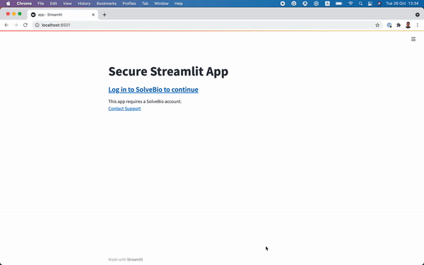

## SolveBio Login for Streamlit Apps

This module provides OAuth2-based login support for Streamlit apps.

About Streamlit: [https://streamlit.io/](https://streamlit.io/)


### Securing Streamlit app

Create a new app in SolveBio RUO and copy app's client id and secret to .env file.

`SolveBioStreamlit` class is used to wrap Streamlit apps with SolveBio OAuth2. Once the user is successfully authenticated, OAuth2 `token` and the initialised `SolveClient` are saved to the Streamlit's session state. You can access them:
```python
st.session_state.solvebio_client
st.session_state.token
```

Wrapping Streamlit app:

```python
def streamlit_demo_app():
    # Getting the sovle client from the Streamlit session state
    solvebio_client = st.session_state.solvebio_client
    user = solvebio_client.User.retrieve()

    st.title("Solvebio app")
    st.header(f"Welcome back {user['first_name']}!")

# Wrapping Streamlit app with SolveBio OAuth2
secure_app = SolveBioStreamlit()
secure_app.wrap(streamlit_app=streamlit_demo_app)
```


### SolveBio secure Streamlit app demo

To run streamlit demo app:
```bash
streamlit run app.py
```

