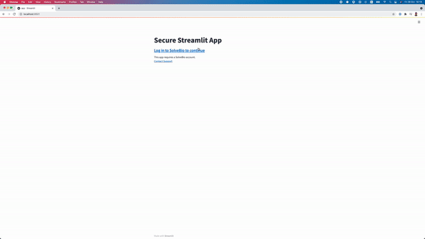

## SolveBio Login for Streamlit Apps

This module provides OAuth2-based login support for Streamlit apps.

About Streamlit: [https://streamlit.io/](https://streamlit.io/)

License: MIT

### SolveBio secure Streamlit app demo

Wrapping Streamlit apps with SolveBio OAuth2:
```python
def streamlit_demo_app():
    st.title("Solvebio app")
    st.write("Restricting access to the Streamlit app.")

secure_app = SolveBioStreamlit()
secure_app.wrap(streamlit_app=streamlit_demo_app)
```

Create a new app in SolveBio RUO and copy app's client id and secret to .env file.

To run streamlit demo app:
```bash
streamlit run app.py
```


